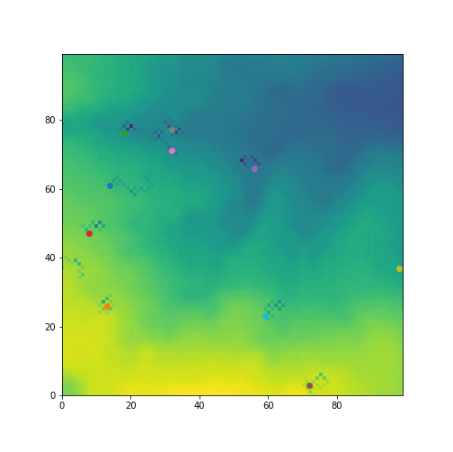

<html>
<head>
<style>
ul {
    list-style-type: none;
    margin: 0;
    padding: 0;
    overflow: hidden;
    background-color: #333;
}

li {
    float: left;
}

li a, .dropbtn {
    display: inline-block;
    color: white;
    text-align: center;
    padding: 14px 16px;
    text-decoration: none;
}

li a:hover, .dropdown:hover .dropbtn {
    background-color: #FFA500;
}

li.dropdown {
    display: inline-block;
}

.dropdown-content {
    display: none;
    position: absolute;
    background-color: #f9f9f9;
    min-width: 160px;
    box-shadow: 0px 8px 16px 0px rgba(0,0,0,0.2);
    z-index: 1;
}

.dropdown-content a {
    color: black;
    padding: 12px 16px;
    text-decoration: none;
    display: block;
    text-align: left;
}

li a.active {
    background-color: #FFA500 ;
    color: white;
}

.dropdown-content a:hover {background-color: #FFA500}

.dropdown:hover .dropdown-content {
    display: block;
}

</style>
</head>

<body>
<ul>
  <li><a href="index.html">About Me</a></li>
  
  <li class="dropdown">
    <a href="javascript:void(0)" class="dropbtn">GEOG5995M</a>
    <div class="dropdown-content">
      <a class = "active" href="#">Assignment 1</a>
        <a href="GEOG5995MA2.html">Assignment 2</a>
    </div>
  </li>
    <li class="dropdown">
    <a href="javascript:void(0)" class="dropbtn">SLSP5301M </a>
    <div class="dropdown-content">
      <a href="#">Assignment 1 and 2</a>
        <a href="#">Assignment 3</a>
    </div>
  </li>
    </li>
    <li class="dropdown">
    <a href="javascript:void(0)" class="dropbtn">MM8040</a>
    <div class="dropdown-content">
      <a href="#">Assignment 1</a>
        <a href="#">Assignment 2</a>
          <a href="#">Assignment 3</a>
            <a href="#">Assignment 4</a>
              <a href="#">Assignment 5</a>
    </div>
  </li>
  <li><a href="https://datacdt.org/">News</a></li>
</ul>

</body>

</html>

## Assignment 1

The project [brief](http://www.geog.leeds.ac.uk/courses/computing/study/core-python-phd/assessment1/index.html) outlined the aims for the assignment. The main aim was to create an online portfolio of my practial work. 

This page displays my code, including a downloadable link, as well as other interesting parts of my Agent-based model (ABM).

The image is a compilation of sequential snapshots of my ABM at different frames.

<center></center>


To begin, I created two files one was my _agentframework_ class and the other was the _model_. This class was called *Agent* which includes a set of behavioural rules governing my agents and their environment. The _model_ contains the environment and additional code that brings the rules and agents to life.

In the _agentframework file_ I started with the initialisation function:

```
import random

class Agent:

def __init__(self, environment, agentlist):
        '''The init function serves as the constructor and self represents the instance of the object itself.
           So here I'm constructing an environment and a list of agents''' 
        self.columny = (random.randint(0,99))
        self.columnx = (random.randint(0,99))
        '''I set the generation of (y,x) columns to random and between 0-99''' 
        self.environment = environment
        self.agentlist = agentlist
        self.store = 0
        '''The objects: environment, agentlist and store were also created at this point'''
```
Before we proceed, I'll define some of the objects used in this ABM for clarity.

| Object        | Definition    | 
| ------------- |:-------------:| 
| Environment   | The vacinity at which agents exhibit the behavioural rules |
| Agentlist     | A list of all agents within my model |
| Columns(y,x)  | Co-ordinates of agents starting location. Numbers are randomly generated numbers between 0-99 |
| Store         | Storage of resources agents accumulate from the environment or neighbours|
| Neighbourhood | Acts as a radius of distance between agents, currently set to 20 |

In the _model_ file the data was extracted from an external file and imputed into the Environment.

```
f = open('in.txt', newline='') 
reader = csv.reader(f, quoting=csv.QUOTE_NONNUMERIC)

for row in reader:	
    rowlist = []
    for value in row:				
        rowlist.append(value)
    environment.append(rowlist)
    
    			
f.close()

```

In the _agentframework_ file, the next step was to define how my agents could _move_ in the Environment.

```
def movement(self):
        '''This statement generates a random number with a condition. If that it is less than 0.5 then 1 is
           added to the value (y,x) co-ords. If its more than 0.5 then 1 is taken away. The %100 creates 
           a boundary that ensures agents return back into frame if they fall off the edges.
        if random.random( ) <0.5:
            self.columny = (self.columny + 1) % 100
        else:
            self.columny = (self.columny - 1) % 100
         
        if random.random( ) <0.5:
            self.columnx = (self.columnx + 1) % 100
        else:
            self.columnx = (self.columnx - 1) % 100
        print ("I'm here:" , self.columny, self.columnx)
        '''The print function will print where when agents are on the 100 x 100 figure.'''

```

The output for the _move_ function is shown below:

```
'''With just 2 agents'''
I'm here: 98 79
I'm here: 23 82
```
Next, I defined an _eat_ function. This would make agents "eat" or take away from the environment and put it in their personal store.

```
def eat(self):
        '''This IF statment states that within the environment, as (y,x) co-ordinations,if it has more than 10 
        resources, and the agents personal store is equal or less than 100 - then the environment will lose 10
        resources and yhe agents personal store increases by 10'''
        if self.environment[self.columny][self.columnx] > 10 and self.store <= 100:
           self.environment[self.columny][self.columnx] -= 10
           self.store += 10

```

Two additional functions were created named _distance between_ and _share with neighbours_, in the _agentframework_ file 

_distance between_ calculates thes distance between agents and prints how far apart they are:

```
'''Checking how far agent 0 is from agent 1'''
agents[0].distance_between(agents[1])

We're this far apart: 75.16648189186454
```

_share with neighbours_ takes the agentlist as well as the distance between each agent and forces them to share based on a condition.
The condition is if the neighbourhood is greater than the distance between each agent, they must share. Essentially, any agent that is within the radius of 20 with any other agents, they must share. 


In _model_ I visualise the agents coming to life, this is the image above. But to further develop the model, I added a *gen_function*.This function acts as a stopping condition. At this point my agents stop eating once they reach 100 resources, but they still move and if they get close to eachother they must share and their stores reduce; the cycle ensues. 

```
def gen_function(b = [0]):
    a = 0
    for i in range(num_of_agents):
           if agents[i].store == 100:
               break
               '''This function creates a random integer, a, so for every agent, once their store reaches 
               100 resources, they stop moving.'''
           else:         
               a = a + 1
               yield a			# Returns control and waits next call.
               # print ("I'm full!")
               '''If the agents store is not equal to 100 resouces, then 1 is added to a every time until
                  the condition is satisfied.'''
```
The full code for both the _agentframework_ and _model_ will be linked down below.

Once my model was working, I created tests to ensure they would always work. The tests were created using *pytest*.

I created an additional file to test each function within my _agentframework_. Below are the examples for *move* and *eat*.

```
'''Defining a class to test the eat function'''    
def test_eat():
    '''The agent created above somewhere in the environment that has 100 units of food'''
    agents[0].environment[agents[0].columny][agents[0].columnx] = 100
    '''The agents current store is 0'''
    agents[0].store = 0
    '''This makes the agent eat'''
    agents[0].eat()
    
    '''Based on my original eat function, if the environment has more than 10  units of food, it should decrease by 10
       and add 10 to the agents store. There the environment should now have 90 units of food and the store should have 10.'''
    assert agents[0].environment[agents[0].columny][agents[0].columnx] == 90
    assert agents[0].store == 10
    '''If the test passes then the eat function works'''
    
    '''This tests if the environment works correctly, if the test passes then the function works'''
    agents[0].environment[agents[0].columny][agents[0].columnx] = 10
    agents[0].eat()

    assert agents[0].environment[agents[0].columny][agents[0].columnx] == 10
    
def test_move():
     '''Agent 0 is at (0,0)'''
     agents[0].columny = 0 
     agents[0].columnx = 0
     '''Agent moves according to condition in framework'''
     agents[0].movement()
     '''Agent could only ever land on (1,99)(99,1), therefore test passes'''
     assert agents[0].columny == 1 or agents[0].columny == 99
     assert agents[0].columnx == 1 or agents[0].columnx == 99
    
pytest.main()    

```


The link to the full code is here: (https://github.com/deborah-O/GEOG5995M_Assignment_1)
